# What is a TL;DR, actually?

### A Reddit TL;DR is expected to be a summary. We measure how far it sits from an AI summary, and how that varies by community

Group members: Jorge Lastra, Kanta Ito

---

## Introduction

When a Reddit post ends with **"TL;DR: …"** line, that line is usually
treated as a summary. The Webis-TLDR-17 corpus (Völske et al., 2017) was built
on this assumption and is widely used as human "ground-truth" summaries, as in a landmark RLHF paper from OpenAI in which TL;DR is used as human made summaries (Stiennon et al. 2020).

Working with the corpus we found that many TL;DRs are not exactly summaries: some are
jokes, questions, or replies. Our first instinct was to classify them, and we
built a small rule-based typology (summary, question, reaction, advice). It
worked as a rough description, but we could not validate the categories without
manual labels, and forcing every TL;DR into one box hid more than it showed.
So we changed the question. Instead of asking *what type is this TL;DR*, we ask
*how far is it from a plain summary*, and to make "plain summary" concrete we
generate one for every post with Gemma 3 27B as a fixed reference point. That reference point appears throughout every result below.

**We treat the TL;DR as a text of unknown type, and measure how far it sits
from an AI summary (as a fixed reference point). Then we ask how that distance differs across communities.**

We look at four things, on the human TL;DR and on the AI summary alike:

1. **Does the first person survive?** voice.
2. **Surface signals** how often a TL;DR contains a question mark or
   advice-type words. We report *rates only* and do not label a TL;DR a
   "question"; we say it *may* read as one.
3. **Semantic distance** cosine similarity between post and TL;DR.
4. **Keyword containment** do the post's key words appear in the TL;DR.

## Dataset

We use the **Webis-TLDR-17** corpus (Völske et al., 2017): 3,848,330 Reddit
posts from 29,651 subreddits, each with the author's own TL;DR
([dataset](https://huggingface.co/datasets/webis/tldr-17),
[paper](https://aclanthology.org/W17-4508.pdf)). We group nine subreddits into
three buckets and draw a stratified sample of **39,859 posts** (up to ~5,000 per
subreddit; 100–600 content words; TL;DR ≥ 10 words).

| Bucket | Subreddits |
|--------|------------|
| political | politics, PoliticalDiscussion, worldnews |
| mental_health | depression, offmychest, Anxiety |
| advice | legaladvice, personalfinance, relationships |

For the AI summaries we take a **stratified subsample of ~200 posts per
subreddit (~1,800 total)** and generate one summary each. All results are
aggregates; no usernames are shown; mental-health posts are never quoted.

## Methods

### Setup

Plain Python, CPU-only for items 1–4 (the AI summary is made with Gemma 3 27B).

- Python 3.11; dependencies pinned in [`code/requirements.txt`](code/requirements.txt).
- Recreate and test:

```bash
conda create --name tldr python=3.11
conda activate tldr
pip install -r code/requirements.txt
pytest code/tests -q
```

Run order and file-by-file flow are in [`code/RUNNING.md`](code/RUNNING.md) and
[`code/PIPELINE.md`](code/PIPELINE.md); a full walkthrough is in
[`code/GUIDE.md`](code/GUIDE.md).

### Experiments

**Preprocessing.** `01_inventory.py` counts posts per subreddit; `02_sample.py`
filters and draws the stratified sample into `sample.jsonl`.

**Human features.** `03_features.py` computes one row per post
(`src/tldr_audit/features.py`): first-person density, the surface flags
(`has_question_mark`, `has_advice_marker`, `has_second_person`),
`summary_novelty`, `keyword_containment`, sentiment, and compression.
  
**AI summaries.** `04_ai_baseline.py` sends each subsampled post body to
**Gemma 3 27B**, served with vLLM on the University of Konstanz computational
cluster, at **temperature 0** (deterministic output) with one neutral prompt,
identical for every subreddit:

> *System:* "You are a neutral summarization baseline. Write a faithful, concise
> summary of a single Reddit post. Add no opinions, advice, questions, or jokes,
> and no information not in the post. Output only the summary text — no preamble,
> no quotation marks, no labels."
> *User:* "Summarize the following Reddit post in one or two sentences. Do not
> add anything that is not in the post."

We deliberately do **not** tell the model to keep the first person, so the
model's own default is what we measure (item 1). No external API is involved;
the model runs entirely on university infrastructure.

**Semantic distance & comparison.** `06_semantic_distance.py` computes
cosine(post, TL;DR) with Sentence-BERT, or TF-IDF cosine as a no-download
fallback so it runs anywhere. `07_human_vs_ai.ipynb` (also available as
`07_human_vs_ai.py`) measures items 1–4 on the human TL;DR and the AI summary
for each post, aggregates per subreddit and overall, and saves one figure per
metric to `results/figures/`.

->change the explanation to the latest file name and pyhton file option for each explanation.

## Results and Discussion

_The community figures (compression, summariness) are built from the
full human sample of 39,859 posts. The human-vs-AI comparison (items 1–4) uses
the 1,800-post subsample with AI summaries; the full table is in
`code/results/tables/human_vs_ai_by_subreddit.csv`._

---

<<<<<<< HEAD
### What a TL;DR looks like

People keep only a small share of their own words. The median TL;DR is 8 to 13% of the post's length, and this ratio is nearly identical across all three community types. The AI summary compresses at the same ratio. Whatever separates the human TL;DR from a plain summary, total length is not it.

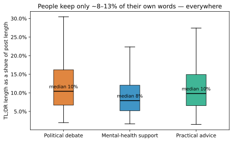

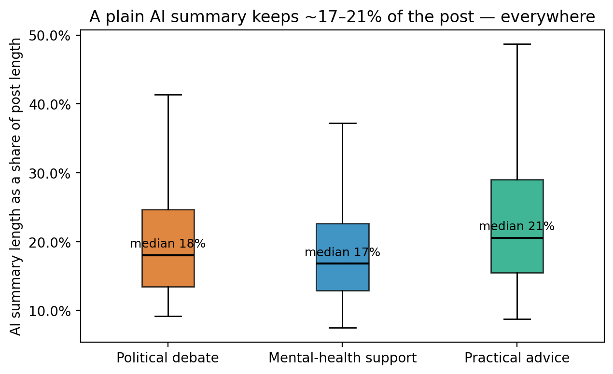
=======
-> explanation need to be the comparison with AI summary length.

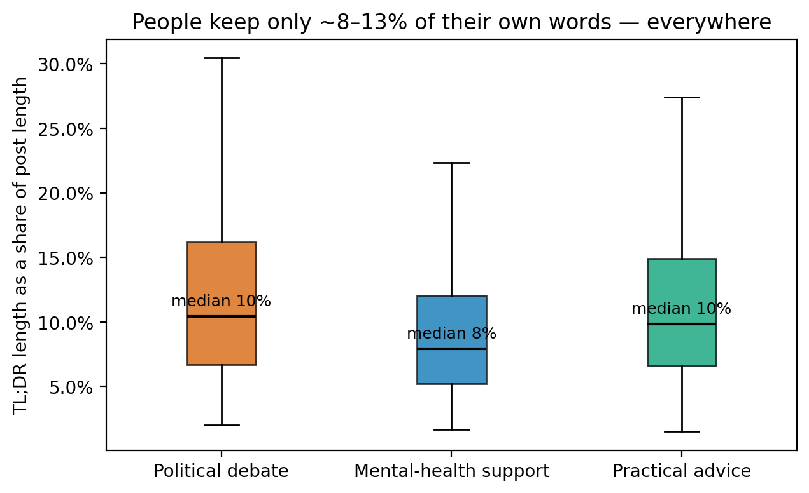

### 1. Does the first person survive?

Summarizing generally thins out the first person: an AI summary tends to shift
"I can't pay my rent" toward "the poster has a payment issue". Yet in Reddit's
advice and mental-health communities the TL;DR keeps "I" at nearly the density
of the post. So the survival of the first person is not a property of
summarizing, it is a property of Reddit's self-narration culture, strongest
where people tell their own stories and near-absent in political writing.
->avoid deplicated explanation with First person density comparison

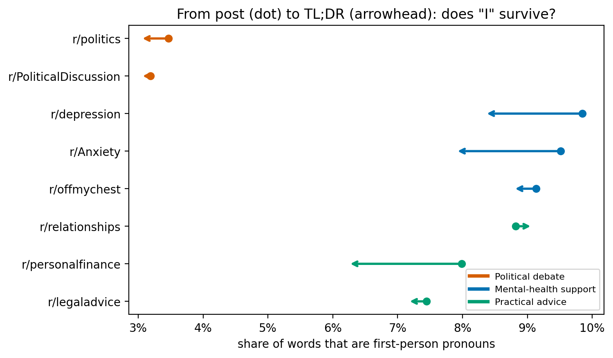

->add explanation on the difference of first person density between AI and TL;DR
・AI doesnt include first person but TL;DR does. this is main point.
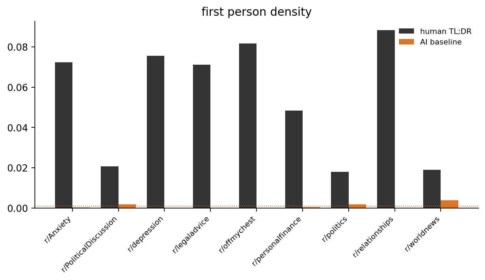

>>>>>>> 928cc603124f1be3a8d6e98367f6122b48105955

Beyond length, TL;DRs show consistent surface patterns across communities. Many contain question marks or advice-type words (should / need to / avoid ...). We report these as rates only: a question mark *may* mean the TL;DR is really a question rather than a summary, but we do not stamp a label on it. These rates differ by community and become legible only once placed beside the AI baseline, which we do in the next section.

<<<<<<< HEAD
How far a TL;DR sits from the post in meaning and vocabulary tells a clearer story. Combining cosine similarity (semantic distance) and keyword containment (lexical overlap) separates three cases:
=======
We count how often a TL;DR contains a question mark or advice-type words
(should / need to / avoid …). We stop at the rate: a question mark **may**
indicate the TL;DR is really a question rather than a summary, but we do not
label it as such. These rates differ by community, political comment threads
carry far more "reaction"-like markers than advice self-posts, and reading the
rates, rather than forcing a category, keeps the interpretation open.
-> add AI and TL;DR comparison explanation from the result (07_share_question_mark.png and 07_share_advice_words.png)
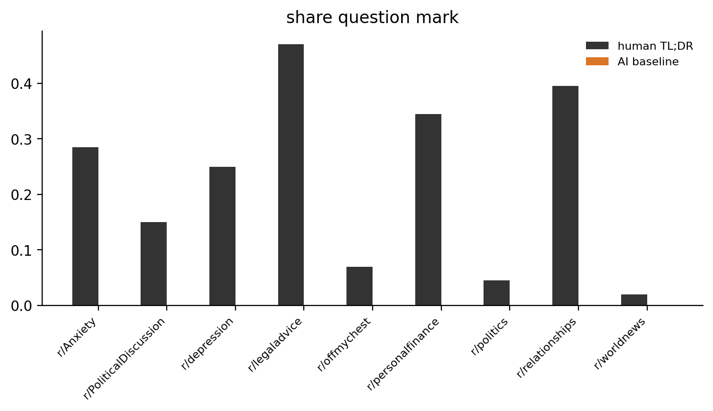
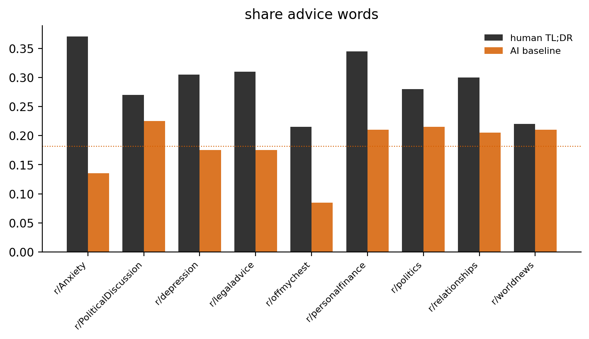
>>>>>>> 928cc603124f1be3a8d6e98367f6122b48105955

- high containment + high cosine: an extractive summary
- **low containment + high cosine: a paraphrase** (different words, same meaning)
- **low containment + low cosine: genuinely diverged** (not really a summary)

Across communities, only ~6% of TL;DRs are clearly extractive. Most rewrite the post in new words, and political TL;DRs sit farthest from the post.

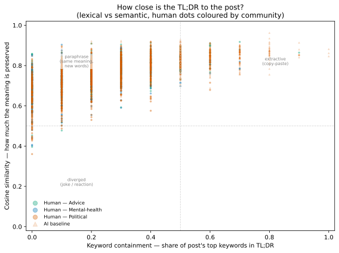

Most human TL;DRs cluster in the paraphrase region: they reuse few of the post's key words but stay close in meaning. The political posts (orange) spread furthest into the diverged corner, where both the words and the meaning move away from the post.

Splitting self-posts from comments explains part of this. Comment TL;DRs barely reuse the post because they are replies, and political communities are ~92% comments. The community gap shrinks once you separate the two, but does not vanish.

<<<<<<< HEAD
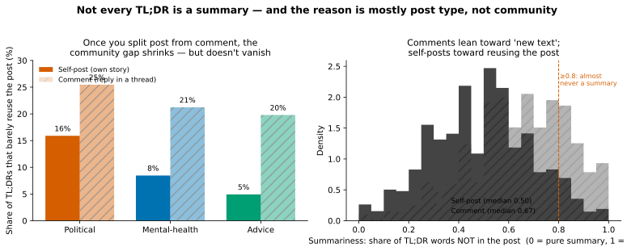

---
=======

Each dot is one post. Most human TL;DRs cluster in the paraphrase region:
they reuse few of the post's key words but stay close in meaning. The
political posts (orange) spread furthest into the diverged corner, where both
the words and the meaning move away from the post.


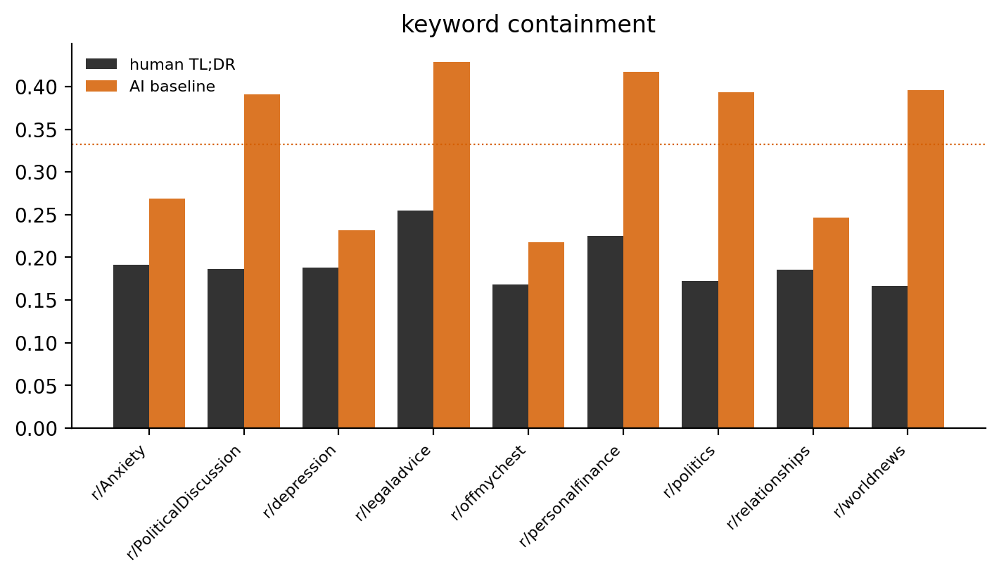

->add the AI and TL;DR comparison explanation like below
・TL;DR is little bit less cosine similarity score but almost same with AI, but if you see the keyword containment, AI outperform in this. it suggest TL;DR summarise but paraphrasing.


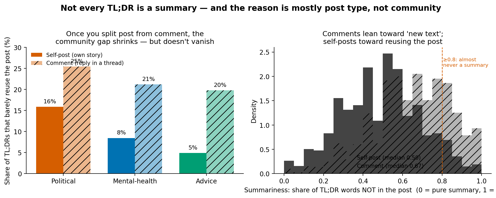
>>>>>>> 928cc603124f1be3a8d6e98367f6122b48105955

### Human TL;DR vs. AI baseline

The figures below measure the same four things on the human TL;DR and on the AI summary of the same post. The AI is a ruler, not a judge: a single model at temperature 0 with a neutral prompt, used to make the human patterns visible by contrast.

#### First person

<<<<<<< HEAD
The AI summary at temperature 0 produces almost no first person: density sits near zero across all subreddits. Human TL;DRs in advice and mental-health communities keep "I" at 7 to 9% of words, a gap of more than 50 times. This is not a feature of summarizing in general; it reflects how Reddit writers narrate their own situations. The survival of the first person is strongest where people tell their own stories and near-absent in political writing.

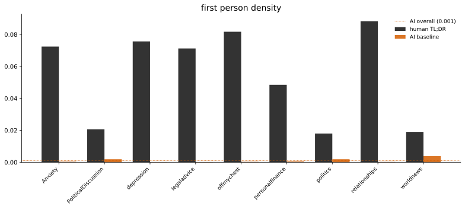

#### Surface signals
=======
**Sentiment.** We compare the mood of the post body, the human TL;DR, and the
AI summary on the same axis. Human TL;DRs mostly drift toward neutral, with
r/depression staying negative and r/Anxiety moving calmer. The AI summary
behaves differently: it lands consistently on the negative side of both the
body and the human TL;DR, most visibly in the advice communities, where the
body reads positive but the AI summary reads negative. We report this as an
observation, not a finding. Two explanations are plausible and our data cannot
separate them: VADER may score the AI's clinical wording as negative even when
the content is neutral, or the AI may genuinely strip the positive framing
that authors give their own stories. We return to this in Further research.
>>>>>>> 928cc603124f1be3a8d6e98367f6122b48105955

Question marks appear in 22.6% of human TL;DRs overall. In r/legaladvice the rate reaches 47%, so nearly half of those TL;DRs read as questions rather than summaries. The AI baseline produces almost none.

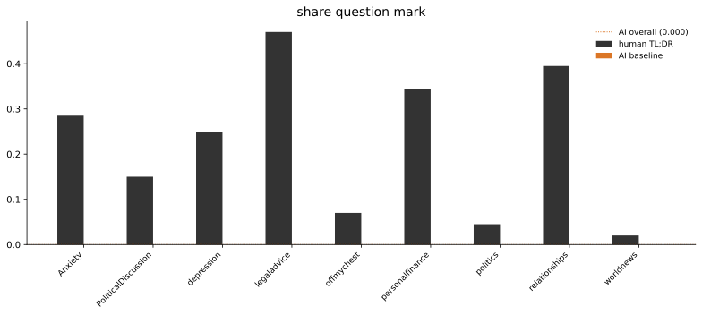

Advice words follow the same pattern. Human TL;DRs in r/Anxiety, r/legaladvice, r/personalfinance, and r/relationships use them at rates between 30 and 37%, while the AI baseline stays near 18 to 22% across all subreddits.

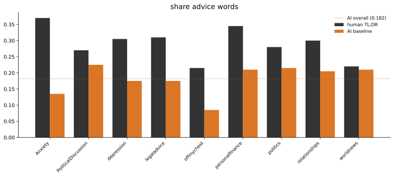

#### Semantic distance and keyword containment

The human cosine to the post is slightly lower than the AI baseline (0.74 vs 0.80), but the gap in keyword containment is larger: the AI reuses 33% of post keywords while human TL;DRs reuse only 19%. The combination confirms what the scatter map showed: human TL;DRs summarize by paraphrasing rather than extracting, and they do so more freely than the AI.

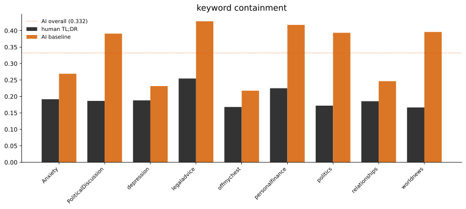

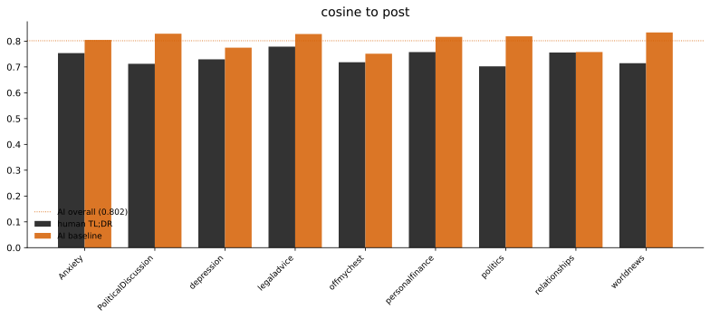

#### Sentiment

We compare the mood of the post body, the human TL;DR, and the AI summary on the same axis. Human TL;DRs mostly drift toward neutral, with r/depression staying negative and r/Anxiety moving calmer. The AI summary behaves differently: it lands consistently on the negative side of both the body and the human TL;DR, most visibly in the advice communities, where the body reads positive but the AI summary reads negative. We report this as an observation, not a finding. Two explanations are plausible and our data cannot separate them: VADER may score the AI's clinical wording as negative even when the content is neutral, or the AI may genuinely strip the positive framing that authors give their own stories. We return to this in Further research.

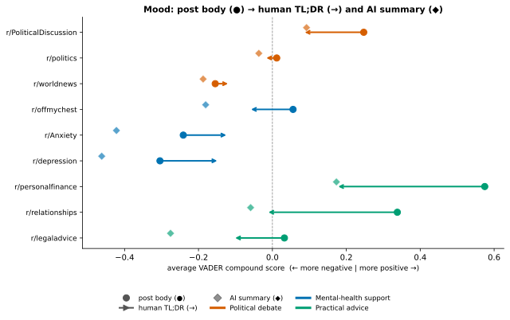

Taken together, the comparisons tell a consistent story. First person: human TL;DRs keep "I" at more than 50 times the rate of the AI baseline. Question marks: 22.6% of human TL;DRs contain one, the AI almost never does, and in r/legaladvice that rate reaches 47%. Keyword containment: the AI reuses 33% of post keywords versus 19% for human TL;DRs. Cosine: human TL;DRs sit slightly farther from the post in meaning (0.74 vs 0.80). The human TL;DR is not a worse summary; it is doing a different job.

---


->summarise AI vs TL;DR discussion by changing the below sentences

The five panels place the human TL;DR (dark) beside the AI summary (orange)
for each community. The gaps are large and consistent. First person: 5.5% of
human TL;DR words vs 0.1% in the AI summary, a difference of more than 50×.
Question marks: 22.6% of human TL;DRs contain one, the AI never does; in
r/legaladvice the human rate reaches 47%, so nearly half of those TL;DRs read
as questions rather than summaries. Meanwhile the AI summary is both
semantically closer to the post (cosine 0.80 vs 0.74) and reuses more of its
key words (33% vs 19%). The human TL;DR is not a worse summary; it is doing
a different job.


### Limitations

These are surface and abstractive proxies, **not** semantic verdicts. Keyword
containment and novelty are lexical; a faithful paraphrase scores as "novel".
Cosine is a **distance we describe, not a decision** that a TL;DR "is not a
summary"; low cosine means far in meaning, which is evidence, not proof. The
surface flags are reported as rates, not categories. The AI summary is one
model's output at temperature 0, a single reference point, not ground truth,
and not something we audit. VADER is blunt on short text and the corpus is 2017
English Reddit, so magnitudes are directional.

## Further research

Three directions came out of this work that we consider worth pursuing.

**What TL;DRs actually are.** We deliberately stopped at rates and distances
instead of labelling each TL;DR. A validated classifier of TL;DR types
(summary, question, reaction, advice), built on manually annotated data,
would turn our descriptive gaps into a typology that dataset builders could
use to filter or stratify corpora like Webis-TLDR-17.

**Bias introduced by AI summarization.** The reference model rewrites every
post in the same register: third person, neutral, no questions. If such
summaries are consumed at scale, subtle shifts in tone and framing could
accumulate. Measuring what AI summarization systematically adds or removes,
across models and communities, follows naturally from our setup.

**The sentiment gap of AI summaries.** Our AI summaries score consistently
more negative than both the post and the human TL;DR. Whether this reflects a
limitation of lexicon-based sentiment tools on formal summary language, or a
real tendency of the model to drop the positive framing people give their own
stories, is an open question. Answering it would need a sentiment method
validated on summary-style text, and more than one summarization model.

## Conclusion

A TL;DR is a text of unknown type. Measured against an AI summary as a fixed
reference point, the human TL;DR sits a measurable distance from a plain summary:
it keeps the author's first person, sometimes reads as a question or a
reaction, and rewrites rather than reuses the post, and that distance varies
systematically across communities and between self-posts and comments. This
means Webis-TLDR-17 is not uniformly a set of ground-truth summaries: the label
"TL;DR" hides heterogeneity that a summarizer trained on it inherits.

## Contributions

| Team Member | Contributions |
|-------------|---------------|
| Jorge | Model serving (Gemma 3 27B via vLLM on the university cluster), AI summary generation, GPU notebooks on the H100 (embeddings, semantic distance, human-vs-AI comparison), sentiment comparison |
| Kanta | Corpus inventory and stratified sampling, linguistic feature pipeline, community-level analyses (compression, first person, summariness), report and website |

Research design, interpretation of results, and the narrative were developed
jointly.

## References

- Völske, M., Potthast, M., Syed, S., & Stein, B. (2017). TL;DR: Mining Reddit
  to Learn Automatic Summarization. *Proc. Workshop on New Frontiers in
  Summarization*, 59–63.
- Stiennon, N., Ouyang, L., Wu, J., Ziegler, D., Lowe, R., Voss, C., … Christiano, P. (2020). Learning to summarize from human feedback. NeurIPS, 33, 3008–3021.
