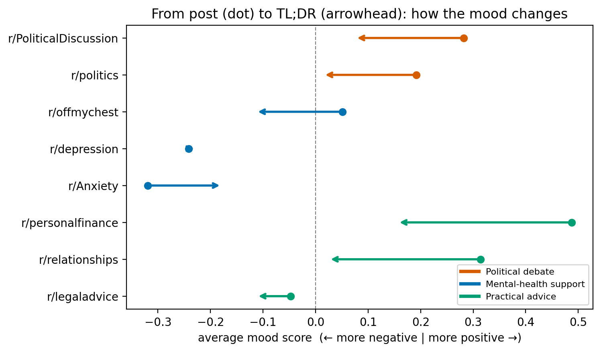

# Whose Words Survive?

### What a Reddit TL;DR actually is — and how it differs by community

_Group members: Jorge, Kanta_

---

## Introduction

When a Reddit post ends with a line like **"TL;DR: …"**, that line looks like a
gift to anyone studying summarization: a short summary of a long text, written
by the same person who wrote the text. The Webis-TLDR-17 corpus
(Völske et al., 2017) was built on exactly this idea and has since been used
widely as human "ground-truth" summaries.

Working with the corpus, we noticed that many TL;DRs are not summaries at all:
some are jokes, some are questions, some are replies to other commenters. This
project sets that observation on a firmer footing and turns it into the research
question:

> **What is a human TL;DR actually doing, and how does that vary across
> communities?**

Concretely, we ask four plain questions about the TL;DR line:

1. Does the first person ("I") survive, or does the author switch to a detached
   third-person summary?
2. How does sentiment move from post to TL;DR?
3. How much of the post is dropped — and is the TL;DR even a summary of it?
4. What *kind* of text is the TL;DR (a summary, a question, advice, a reaction)?

We deliberately keep the study to **human** TL;DRs only. Comparing against
machine-generated summaries is a natural follow-up, but it only makes sense once
we know which human TL;DRs are summaries in the first place — so we treat it as
future work.

## Dataset

We use the **Webis-TLDR-17** corpus (Völske et al., 2017), 3,848,330 Reddit
posts from 29,651 subreddits, each paired with the author's own TL;DR
([dataset](https://huggingface.co/datasets/webis/tldr-17),
[paper](https://aclanthology.org/W17-4508.pdf)).

To compare communities rather than individual subreddits, we group nine
subreddits into three **buckets**:

| Bucket | Subreddits |
|--------|------------|
| political | politics, PoliticalDiscussion, worldnews |
| mental_health | depression, offmychest, Anxiety |
| advice | legaladvice, personalfinance, relationships |

From these we draw a stratified sample of **39,859 posts** (up to ~5,000 per
subreddit), keeping posts with 100–600 content words and a TL;DR of at least 10
words. A key property we track throughout is whether a row is a **self-post**
(the author summarizing their own story) or a **comment** (a reply inside a
thread), because the two use the TL;DR slot very differently.

For privacy, all results are aggregates; no usernames are shown, and posts from
mental-health communities are described in aggregate and never quoted.

## Methods

### Setup

The pipeline is plain Python and runs on a CPU; no GPU is required for the
results in this report.

- Python 3.11
- Dependencies are pinned in [`code/requirements.txt`](code/requirements.txt):
  `pandas`, `pyarrow`, `vaderSentiment`, `matplotlib`, `pyyaml`, `pytest`
  (plus optional `spacy` for named-entity features).

Recreate the environment and run the tests:

```bash
conda create --name tldr python=3.11
conda activate tldr
pip install -r code/requirements.txt
pytest code/tests -q
```

Full step-by-step run instructions are in
[`code/RUNNING.md`](code/RUNNING.md); the file-by-file data flow is in
[`code/PIPELINE.md`](code/PIPELINE.md).

### Experiments

**Preprocessing.** `code/scripts/01_inventory.py` streams the corpus once to
count posts per subreddit (which fixes the bucket choices), and
`code/scripts/02_sample.py` applies the length filters and draws the
deterministic stratified sample into `sample.jsonl`.

**Feature extraction.** `code/scripts/03_features.py` reads the sample and, for
each post, computes one row of features
(`code/src/tldr_audit/features.py`). The measures fall into five groups:

- **Length / compression** — `compression_ratio`, `word_drop_rate`.
- **Summariness** — `summary_novelty`: the share of the TL;DR's meaningful words
  that do **not** appear in the post (0 = pure summary, 1 = all-new wording),
  plus a bigram version (`novel_bigram_rate`) for abstractiveness
  (Grusky et al., 2018).
- **Sentiment** — VADER (Hutto & Gilbert, 2014) compound score for post and
  TL;DR, their shift, and a polarity-flip flag.
- **First-person voice** — pronoun density in post and TL;DR, and whether "I"
  disappears.
- **Speech-act type** — `tldr_type`, a transparent rule-based label assigning
  each TL;DR to **summary / question / advice / reaction** from simple surface
  signals (a question mark, advice words, joke markers, or very high novelty).
  This is a cheap heuristic for *describing* how communities use the slot, not a
  trained or hand-validated classifier.

**Analysis & figures.** The notebooks in `code/notebooks/` read the resulting
`features.parquet` and produce the figures below. No language model is used to
generate summaries anywhere in this pipeline.

## Results and Discussion

### 1. Does "I" disappear?

Advice and mental-health authors stay inside their own summary: the first-person
density of the post (dot) and the TL;DR (arrowhead) sit close together. Political
writing barely uses "I" to begin with (~3% of words vs. ~10% in r/depression), so
there is little personal voice to preserve. The author's presence in a summary is
therefore a community-specific choice, not a constant.


### 2. How does sentiment move?

Most TL;DRs drift toward neutral — summarizing flattens the mood. The exceptions
are the interesting part: in r/depression the TL;DR stays just as negative as the
post (authors do not soften their own account), whereas r/Anxiety moves toward
neutral, as if summarized from a calmer distance. The same "mental-health" bucket
handles emotion in opposite directions.



### 3. How much is dropped — and is it even a summary?

Authors keep about a tenth of their words in every community, so "short" is
universal. But short is not the same as *summarizing*: only ~6% of TL;DRs are
clearly extractive (novelty ≤ 0.2), and the median TL;DR introduces over half new
vocabulary.


The crucial confound is **post type**. Comment TL;DRs barely reuse the post
(median novelty 0.67; 24% are near-pure-new text) because they are replies, not
self-summaries. Political communities looked extreme only because they are ~92%
comments. Splitting self-posts from comments shrinks the community gap but does
not erase it: even among self-posts, political TL;DRs reuse the post least
(~16% high-novelty vs. ~5% in advice).


### 4. What kind of text is the TL;DR?

Using the `tldr_type` label, we can read each community by the **mix** of speech
acts in its TL;DR slot — how often it is a genuine summary versus a question,
advice, or a reaction. This is the most direct answer to "what is the TL;DR
doing", and it is what the earlier human-vs-machine comparison was missing: a
machine always returns a summary, so comparing it against a human reaction would
measure a genre mismatch, not summary quality.

**Limitations.** The summariness and type labels are proxies, not verdicts on any
single post: a faithful paraphrase can still score as "novel", so the score
bounds how common non-summaries are rather than identifying them one by one.
VADER is a blunt instrument on short text, and the corpus is 2017 English Reddit,
so magnitudes should be read as directional.

## Conclusion

A human TL;DR is not a single thing. The slot holds several speech acts —
summary, question, advice, reaction — and the mix is governed first by **post
type** (self-post vs. comment) and second by **community register**. Only about
6% of TL;DRs are clearly extractive summaries, and the typical one rewrites the
post in fresh wording. This matters for anyone using Webis-TLDR-17 as
ground-truth summaries: the label "TL;DR" hides real heterogeneity that varies
systematically across communities. Measuring which TL;DRs are genuine summaries
is the precondition for any later, fair comparison against automatic
summarizers.

## Contributions

| Team Member | Contributions |
|-------------|---------------|
| Jorge | _e.g._ corpus inventory & sampling, feature extraction, figures |
| Kanta | _e.g._ summariness/type analysis, report write-up, website |

_(Edit this table to reflect your actual split of work.)_

## References

- Völske, M., Potthast, M., Syed, S., & Stein, B. (2017). TL;DR: Mining Reddit to
  Learn Automatic Summarization. *Proceedings of the Workshop on New Frontiers in
  Summarization*, 59–63.
- Hutto, C. J., & Gilbert, E. (2014). VADER: A Parsimonious Rule-Based Model for
  Sentiment Analysis of Social Media Text. *Proceedings of the International AAAI
  Conference on Web and Social Media*, 8(1), 216–225.
- Grusky, M., Naaman, M., & Artzi, Y. (2018). Newsroom: A Dataset of 1.3 Million
  Summaries with Diverse Extractive Strategies. *Proceedings of NAACL-HLT*,
  708–719.
